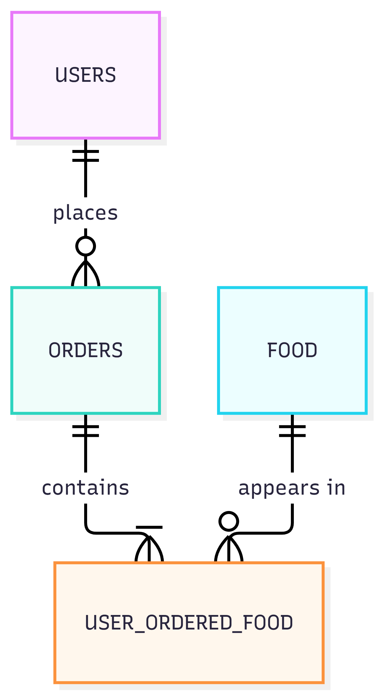

# Georigan-Restaurant-Database

A relational database for running a Georgian restaurant, designed in SQLite as my final project for **Harvard's CS50: Introduction to Databases with SQL**.

## What it models

<!-- 2–3 sentences: what the restaurant needs to track and why -->

## Schema



| Table | What it stores |
|---|---|
| `table_name` | short description |
| `table_name` | short description |

<!-- one line on the key relationships, e.g. "each order belongs to one customer and contains many menu items" -->

## Example queries

```sql
-- what this query answers
SELECT ...
```

```sql
-- what this query answers
SELECT ...
```

All queries are in [`queries.sql`](queries.sql). Full design reasoning is in [`DESIGN.md`](DESIGN.md).

## Run it

```bash
sqlite3 restaurant.db
```

Or rebuild from scratch:

```bash
sqlite3 new.db < schema.sql
```

## Files

| File | Purpose |
|---|---|
| `schema.sql` | table definitions |
| `queries.sql` | example queries |
| `restaurant.db` | the database, ready to query |
| `DESIGN.md` | design document: scope, entities, limitations |
| `diagram.png` | ER diagram |

## Certificate

[CS50 SQL certificate](PASTE-CERTIFICATE-LINK-HERE) · [Video walkthrough](PASTE-YOUTUBE-LINK-HERE)
